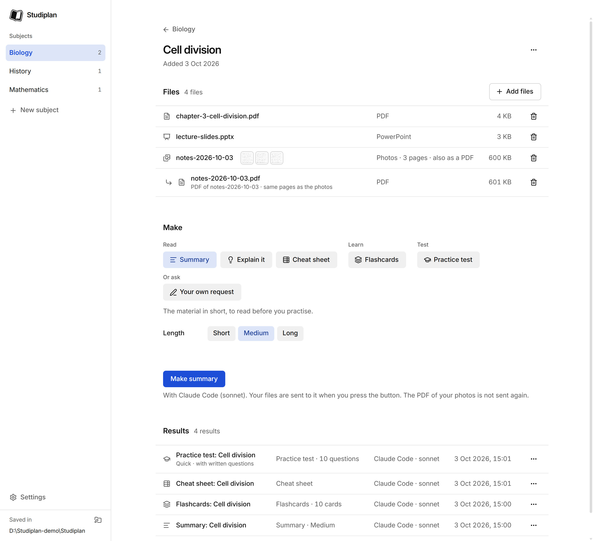
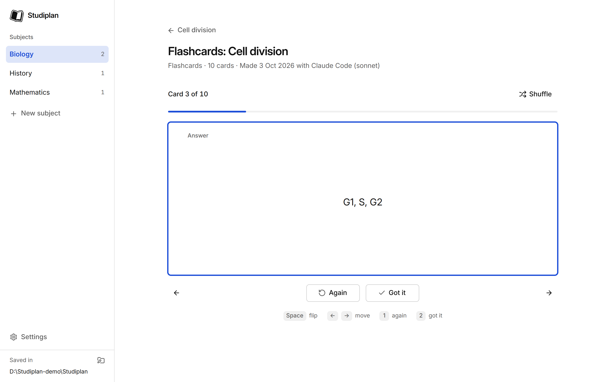
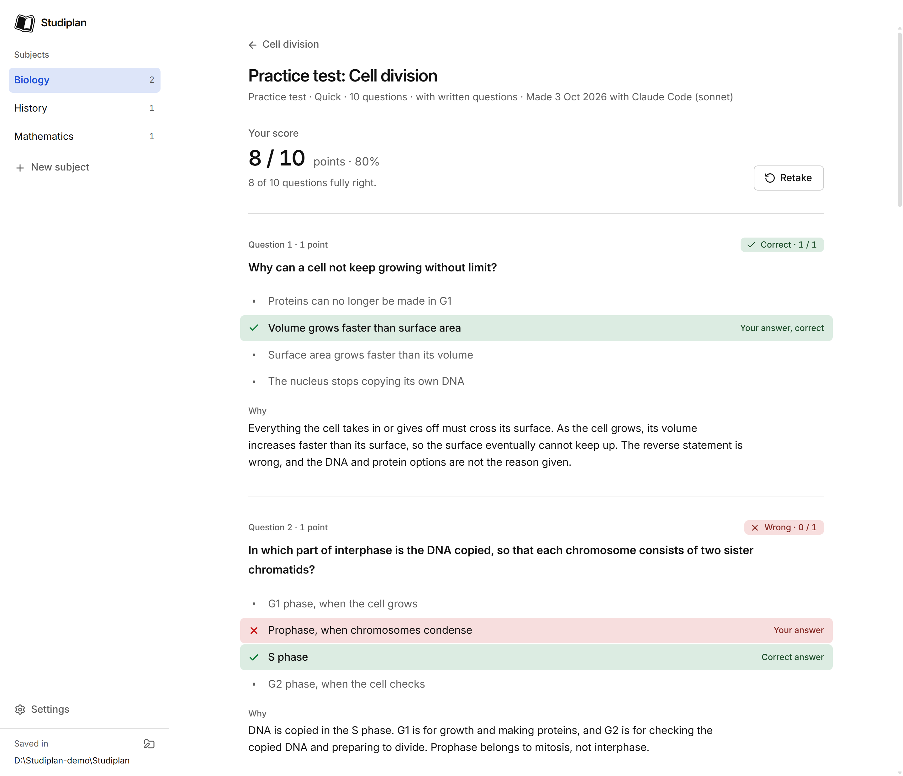
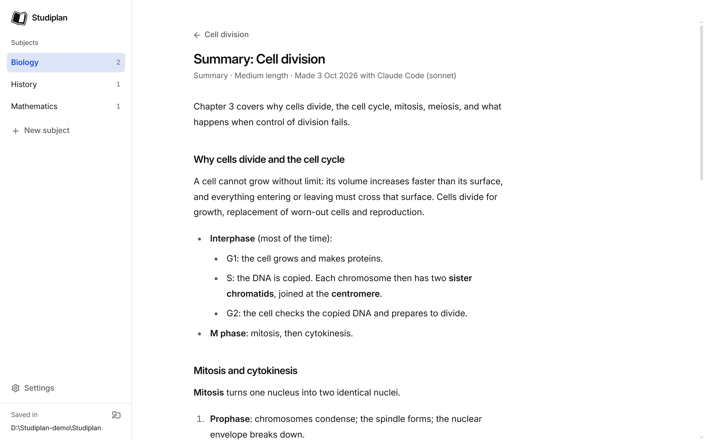
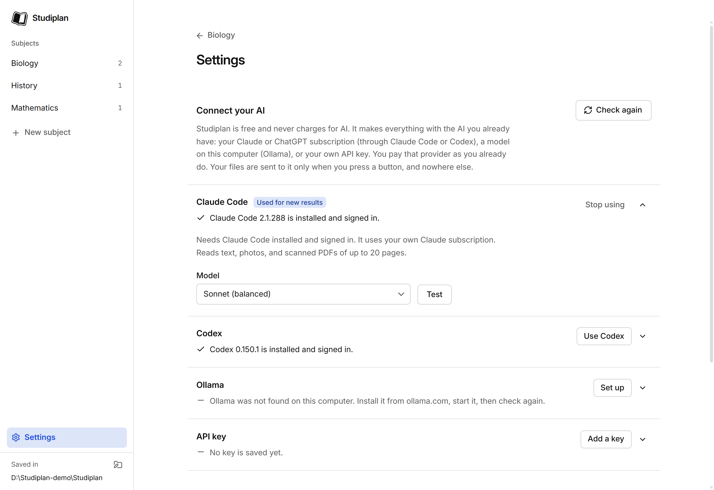

# Studiplan

**Turn your study materials into summaries, flashcards and practice tests — with your own AI, for free.**



Studying with an AI usually means a chat window: you upload the same file again every time, and the
summaries and quizzes scroll away. Studiplan keeps your subjects and materials in an organised
library on your own computer. Inside a material you press a button, your own AI makes a study aid
from it, and the result is saved next to the material and studied in the app.

Studiplan is free and open source. It has no account, no tracking and no paid version, and it never
charges for AI: it uses the AI you already have.

**Download:** [Studiplan for Windows](https://github.com/vinihu/studiplan-app/releases/latest) ·
**Website:** https://studiplan.app · **Questions:** [Discord](https://discord.gg/XQ8P5y8gkS)

## What you can make

| | |
|---|---|
| **Summary** | The material in short. |
| **Explain it** | A walkthrough in plain words, for when you missed the lesson. |
| **Cheat sheet** | One page of key terms, formulas and must-knows. |
| **Flashcards** | Flip, shuffle, "again / got it", redo the ones you missed. |
| **Practice test** | Quick, standard or full exam; marked, with explanations. |
| **Your own request** | Ask for anything else in your own words. |

Add PDFs, PowerPoint files (.pptx) and photos of your notes to a material. Photos can be turned
into one PDF with a button. While something is being made you see what is happening and can cancel,
and the app tells you when part of a material could not be sent to the AI.

Results are written by an AI and can be wrong. Check them against your material.

| | |
|---|---|
|  |  |
|  |  |

## Your own AI

Open **Settings → Connect your AI**, press **Use …** on the one you want, and press **Test**.

| AI | What you need | It can read | Tried for real |
|---|---|---|---|
| **Claude Code** | The `claude` command-line tool, installed and signed in (your Claude subscription). | Text, photos, scanned PDFs of up to 20 pages | Yes |
| **Codex** | The `codex` command-line tool, installed and signed in (your ChatGPT subscription). | Text and photos, not scanned PDFs | Yes |
| **Ollama** | Ollama installed and running on this computer, with a model pulled. | Text; photos only with a model that can see | Not yet |
| **API key** | A key from Anthropic, OpenAI or Google. Usage is billed by them to your own account. | Text, photos, scanned PDFs of up to 20 pages | Not yet |

"Not yet" means that provider is built and tested against a stand-in, but has not been run against
the real service. If it fails for you, please [report it](https://github.com/vinihu/studiplan-app/issues).

Studiplan is free; the AI is yours. If you use a subscription or an API key, you pay that provider
as you already do. Ollama runs on your own computer.

## Privacy and safety

- **Your files stay on your computer.** The library is ordinary folders. A material's text and
  photos are sent only to the AI you chose, at the moment you press a button. There is no Studiplan
  server.
- **The AI tools cannot touch your files.** Claude Code runs read-only and can read only the
  material's own files. Codex runs with every tool switched off. Neither loads your own plugins,
  settings or instruction files. Text inside a material is treated as content, never as
  instructions.
- **Ollama is used only on this computer.** If it is pointed at another machine, Studiplan refuses
  to send material there.
- **API keys** are encrypted by the operating system, never shown again after saving, and sent only
  to the provider they belong to.
- **The app's window cannot reach the internet** and has no access to the disk; everything goes
  through a small, checked bridge to the main process.

## Install

Download the installer from the [latest release](https://github.com/vinihu/studiplan-app/releases/latest).
Windows 10 or later, 64-bit. It installs for you alone, without administrator rights.

The installer is **not signed** — a code-signing certificate costs money and this free project has
none — so Windows SmartScreen shows "Windows protected your PC". Choose **More info**, then **Run
anyway**. On a Windows 11 PC with Smart App Control turned on, Windows will not let an unsigned
installer run at all.

To check your download, compare its SHA-256 with the one in the release notes:

```
Get-FileHash .\Studiplan-Setup-0.1.0.exe -Algorithm SHA256
```

Uninstalling removes the program and leaves your library and settings alone.

## Where your files are

`Documents/Studiplan` by default; change it in Settings or with the small button next to "Saved in".

```
Studiplan/
  Biology/                      a subject
    Cell division/              a material
      material.json
      files/                    chapter-3.pdf, slides.pptx, notes-2026-10-03/page-1.jpg …
      sets/                     2026-10-03-summary.md, 2026-10-03-flashcards.json …
```

Summaries, explanations and cheat sheets are Markdown you can edit in any editor. Deleting in the
app moves things to the Recycle Bin.

## Known limits

- A scanned PDF longer than 20 pages is not sent to any AI. Add photos of the pages instead.
- Formulas in PDFs are often not stored as text and then do not reach the AI. The app warns when it
  notices this.
- The number of cards or questions you ask for is a target, not exact.
- Only Windows has been run. A Mac version is planned.

## Build it yourself

You need [Node.js](https://nodejs.org) 24 or newer.

```
npm install
npm run dev        # run the app with hot reload
npm run dist       # build the Windows installer into release/
```

| Command | What it does |
|---|---|
| `npm run dev` | Start the app with hot reload. |
| `npm run typecheck` | TypeScript, strict. |
| `npm run lint` | ESLint. |
| `npm test` | Unit tests (Vitest). |
| `npm run smoke` | Launch the real app and walk through it end to end with a stand-in AI. |
| `npm run dist:test` | Build a packaged test build (development hooks on). |
| `npm run smoke:packaged` | Walk through the packaged test build. |
| `npm run dist` | Build the release installer. |
| `npm run verify:release` | Check the release build from the outside. |

It is built with Electron, Vite, React, TypeScript, Tailwind and HeroUI.

## Licence

The code is under the [MIT licence](LICENSE). Third-party notices ship with the installer.

The Studiplan name and logo are **not** covered by the MIT licence: you may not use them for your
own version of the app. If you publish a changed version, give it its own name and logo.

Made by vinihu.
